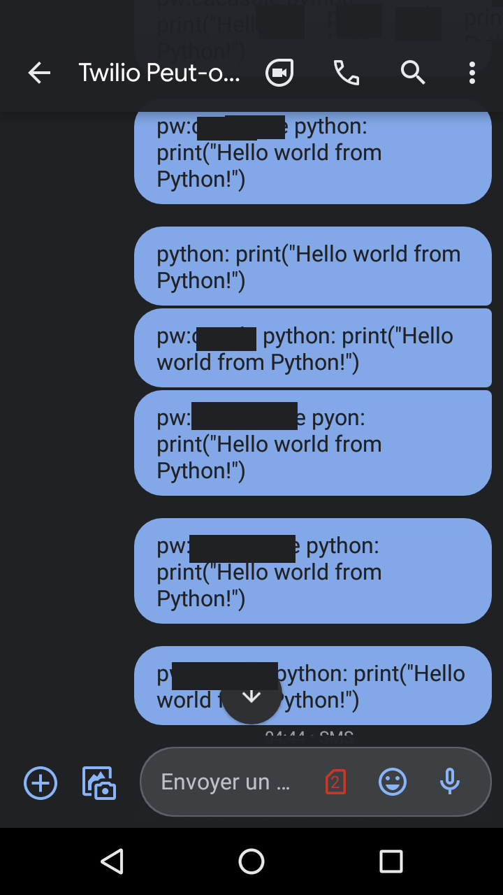
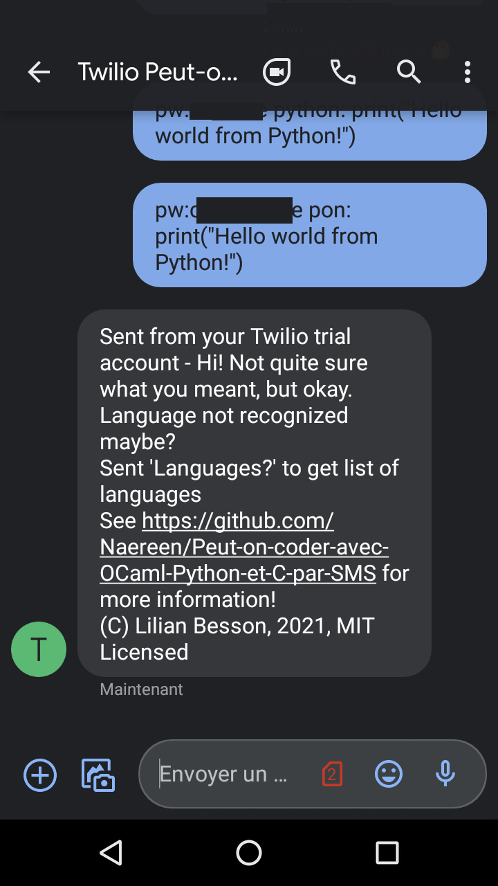
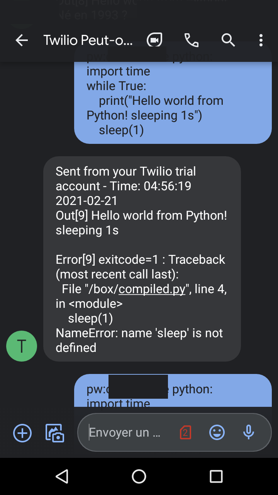
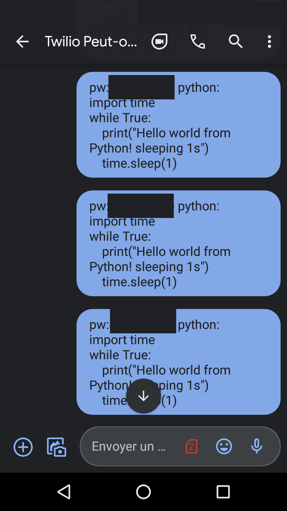
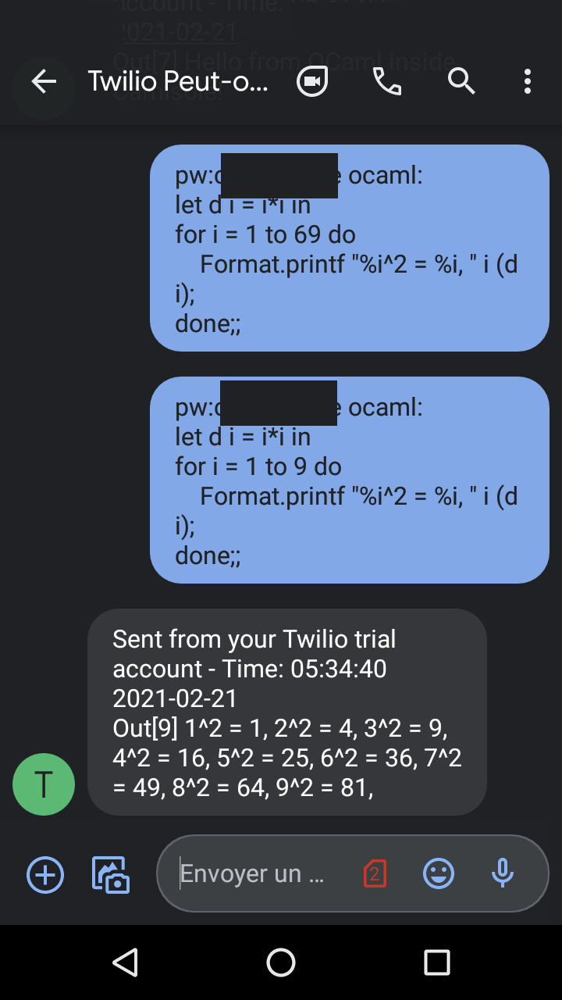
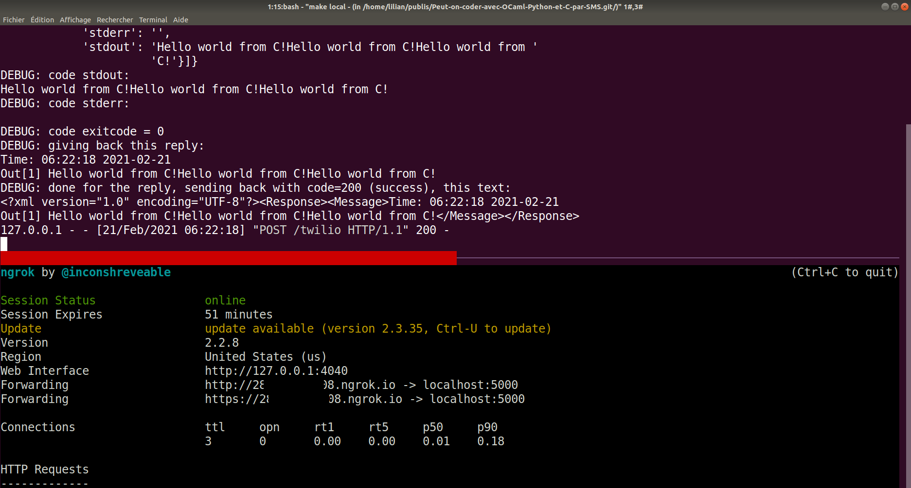

# Documentation des captures d'écran

## Messages de tests sans Camisole backend juste dire bonjour et liste des langages

## Authentification

### Si le mot de passe est present mais faux, rien ne se passe - erreur cote serveur mais bien gérée

## Oh éditeur, gentil éditeur, dis moi, mon code est-il le plus beau ?

### Si un langage n'est pas compris donne un message d'erreur

### Message erreur du compilateur ou interpréteur en cas d'erreur de syntaxe ou d'exécution

## Autres langages

### Ça marche en langage OCaml aussi

### Ça marche en langage C aussi

## Autres remarques

### Si le code est trop lent à exécuter ou compiler, rien n'est renvoyé car le job est tué

### Des fois la réponse peut être lente et arriver apres un autre message

L'ordre n'est pas garanti, mais un petit timestamp est inclus, donc on s'y retrouve !
Et les cellules de sorties sont aussi numérotées !

### Aperçu de l'interface du serveur Flask (backend)

