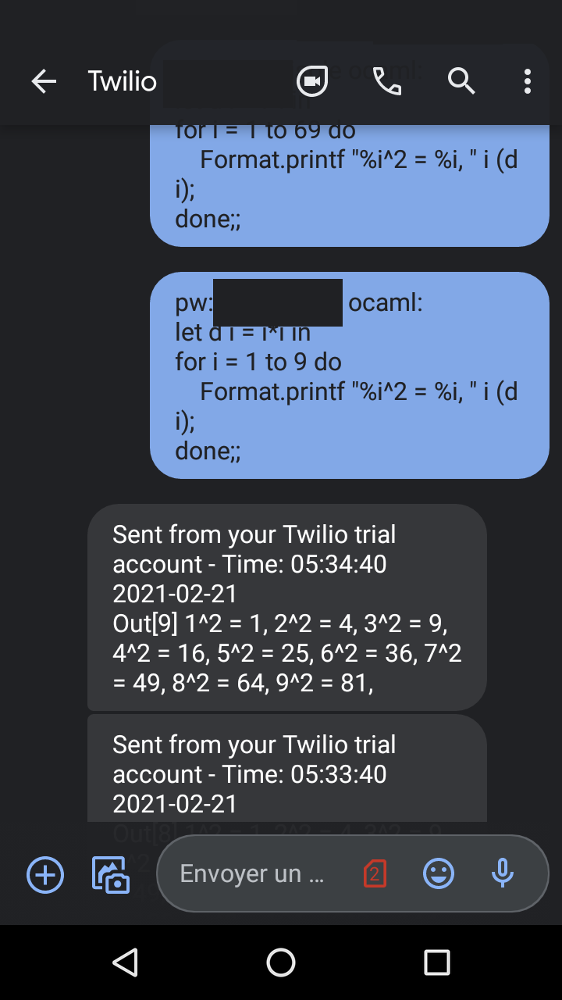
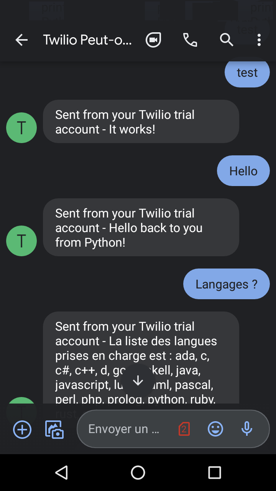
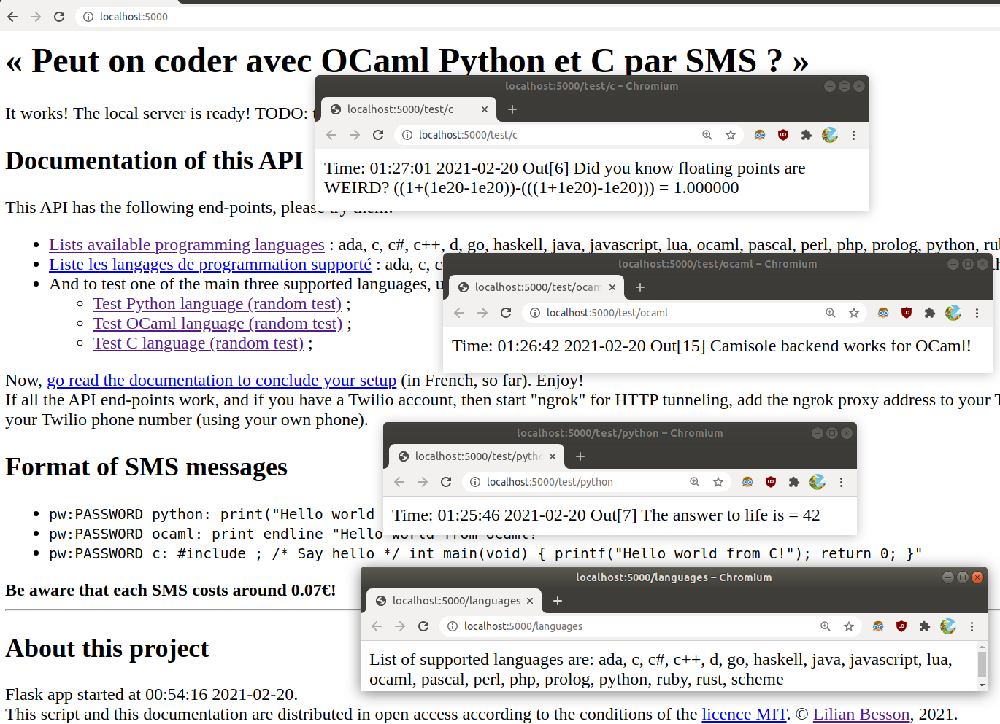
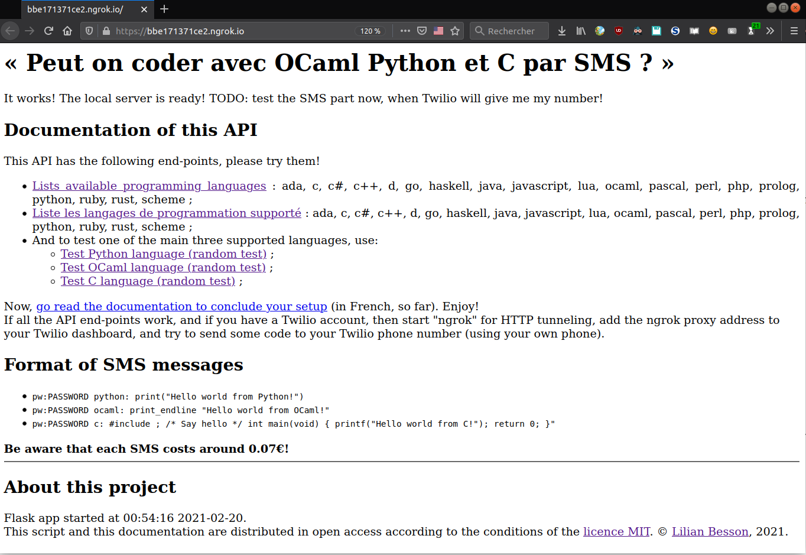
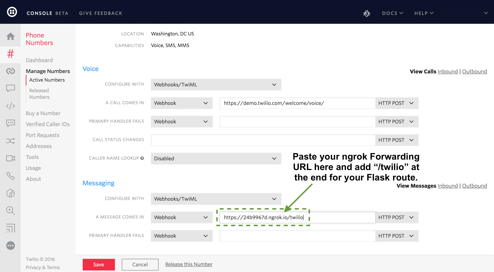
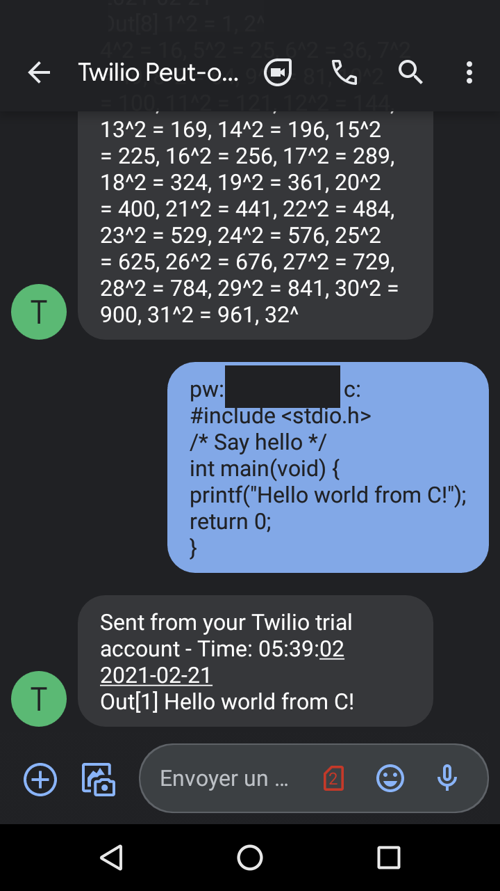

# :fr: :phone: Peut on coder avec OCaml, Python et C par SMS ? *Oui !*

*J'ai répondu à la question suivante* : peut on coder avec OCaml, Python ou C **par SMS** ?
*Spoiler alert*: **oui !**
TL;DR: Voici un schéma d'explication :


## Quel objectif ?

Je souhaitais pouvoir faire ça, depuis mon téléphone :

1. J'envoie un texto qui content « `pw:PASSWORD python: print("Hello world from Python!")` » à `0612345678` (un numéro spécifique, pas le vrai), depuis mon téléphone (sans appli, sans Internet, sans rien d'autre que des vieux SMS en GSM) ;

2. Quelques secondes plus tard, je reçois de ce numéro `0612345678` un SMS qui content « `Python:Out[1] Hello world from Python!` » ;

3. Je veux que ça marche pour des *petits* programmes en *Python 3*, *OCaml 4.05+* et *C11* ;

4. Je veux les fonctionnalités suivantes :
   - qu'il y ait ce mot de passe ;
   - qu'il y ait un numéro incrémental de cellule sortie : trois requêtes de suite seront `Out[1]: ...`, `Out[2]: ...`, `Out[3]: ...`, etc.
   - que ça fonctionne sans problème pour ces trois langages ([voir plus ?](https://github.com/Naereen/Peut-on-coder-avec-OCaml-Python-et-C-par-SMS/issues/10)) ;
 - - que l'exécution soit sécurisée, et isolée (avec [camisole](https://camisole.prologin.org/) dans [une VM](https://camisole.prologin.org/installation.html#vm-image)) ;

5. Premières étapes :
   - que le code soit exécuté sur *ma machine* (ou sur un serveur distant quand ce sera prêt) ;
   - je veux devoir lancer manuellement le serveur, et afficher dans une console ce qui se passe ;

- Références : <https://www.fullstackpython.com/blog/respond-sms-text-messages-python-flask.html> en anglais (lu le 2021-02-19).

## Solution ?

Ce [dépôt GitHub](https://github.com/Naereen/Peut-on-coder-avec-OCaml-Python-et-C-par-SMS) contient un petit script Python 3 (avec un serveur [Flask](https://flask.palletsprojects.com/)) pour expérimenter et essayer cela.

Quelques questions et réponse :

1. **Quel numéro de SMS ?**
  Avec un compte **payant** sur [Twilio](https://www.twilio.com/) (voir [les prix](https://www.twilio.com/sms/pricing/fr)) ;

2. **Quel architecture logicielle ?**

   - Localement sur mon ordinateur, je vais lancer une petite application Web écrite avec [Flask](https://flask.palletsprojects.com/).
   - Cette application écoute un *webhook* local (qui peut être ouvert sur l'Internet global avec [ngrok](https://ngrok.com/)).
   - Quand un message arrive sur ce *webhook*, l'application Flask répond en renvoyant un SMS avec le résultat de l'exécution du code soumis par la requête au webhook.
   - [Avec l'API de Twilio](https://www.twilio.com/console), on peut connecter cette appli (ouverte avec ngrok) [au numéro de téléphone (**payant**) fourni par le compte Twilio](https://www.twilio.com/console/phone-numbers/).
   - Avec tout ça, je peux exécuter (et voir la sortie et le code de retour) en envoyant un SMS à ce numéro.

3. **Où ça en est ?**
   1. ~~Juste une idée pour l'instant.~~
   2. ~~C'était une idée le vendredi 19 février vers 13h, c'était quasiment terminé le soir même !~~
   3. Testé et fonctionnel avec toutes les fonctionnalités que j'espérais, en C, Python et OCaml !
   4. TODO: il reste quelques trucs à faire, regardez les [tickets ouverts](https://github.com/Naereen/Peut-on-coder-avec-OCaml-Python-et-C-par-SMS/issues), et les TODO: dans ce fichier. (et le code), mais bon le "proof of concept" est terminé, moi ça me suffit.

## Exemples

### Usage "simple"

> Attention, ces explications sont aussi complètes que possible, mais tout ce projet est très expérimental !
> Je ne saurai être tenu responsable du moindre problème sur votre machine, faites attention !
> [*hic sunt dracones*](https://en.wikipedia.org/wiki/Here_be_dragons)!

1. [Installer ce projet](#installation) (détails plus bas) ;
2. Créer un compte [Twilio](https://www.twilio.com/try-twilio), il faut un email valide, et un numéro de téléphone valide pour vérifier que vous n'êtes pas un robot !
3. créer un numéro de téléphone Twilio (payant mais 15€ offert, cela permet d'essayer le service pour environ 12/0.14=85 essais, c'est déjà pas mal !) ;
4. Lancer le serveur Flask local, avec avec `make local`, [tester le](#cette-application-flask) ;
5. Si ça marche, essayez le serveur distant avec `make ngrok` et allez ajouter l'adresse ngrok du webhook dans [le panneau de contrôle Twilio](https://www.twilio.com/console/phone-numbers), attention à bien la mettre sous la forme `https://TRUC.ngrok.io/twilio` (j'oublie le `/twilio` une fois sur deux !) ;
6. [Tester avec des exemples](#tester-votre-configuration) :
   - Par exemple `test` pour tester, ou `Langages ?` pour recevoir la liste des langages (possiblement) supportés...
   - Par exemple `pw:PASSWORD python: print("Hello world from Python!")` (avec le mot de passe choisi, remplaçant PASSWORD), [comme montré plus bas](#rocket-des-sms-qui-exécutent-du-code) ;
   - Cela va vous envoyer un texto contenant la réponse de l'exécution de ce programme, si tout est bien configuré !
   - Mais n'en abusez pas trop, :warning: **chaque SMS envoyé et reçu coûte ~0.07€** ! C'est vraiment juste conçu pour « l'effet démo woooooaaa :heart_eyes: » !
7. Soyez tout content :+1: ! Et ajouter une [petite étoile](https://github.com/Naereen/Peut-on-coder-avec-OCaml-Python-et-C-par-SMS/stargazers) :star: à ce projet ! *Parlez en à vos collègues ou à vos camarades, je suis curieux de vos avis et vos idées !*



### Tester votre configuration

Essayez les SMS suivants :

```text
Input: test
Output: It works!
```

```text
Input: Bonjour
Output: Bien le bonjour depuis Python !
```

```text
Input: Langages ?
Output: La liste des langues prises en charge est : c, ocaml, python
```



> - L'ordre de réponse dans les langages peut changer.
> - Plus de captures d'écran dans ce fichier [`DocumentationCapturesEcrans.md`](./DocumentationCapturesEcrans.md).

### Aide

Tout se fait avec un [`Makefile`](./Makefile) (de GNU Make), donc l'aide aussi :

```bash
$ make help
Help for utilities (by Lilian BESSON, https://github.com/Naereen/Peut-on-coder-avec-OCaml-Python-et-C-par-SMS.git)
Please use 'make <target>' where <target> is one of
  setupvenv  to set-up and install requirements in a Python3 virtualenv
  server     to do everything
  local      to do local only
  test_hello_api connects and tests Camisole backend
  test_api   connects and tests Camisole backend
  notify     to notify that the server is ready
  clean      to clean the temp files.
  ngrok      if the local server is ready, open it to the world with https://ngrok.com
```

### Cas d'échec

Les scripts sont écrits en anglais, et ils devraient afficher des messages d'erreurs clairs selon les causes d'échec.
*Merci de signaler des bugs si vous en rencontrez, en précisant quelle version de Camisole, Flask, Twillio, et Python vous utilisez, et en incluant le message d'erreur entier. Merci d'avance :pray: !*

----

## Installation

> Uniquement testé **quelques minutes** sur ma machine, avec Ubuntu 18.04.
>
> - Ca ne marchera **PAS** sous Windows ou Mac.
> - Ca marchera **peut-être** sous d'autres GNU/Linux, ou *NIX-like... mais je ne sais pas.

### Prérequis

Commencez par suivre ces instructions :

- Il faut avoir Python 3, et `virtualenv` (dans la librairie standard) ;
- Il faut avoir `curl` et GNU `make` (normalement présent, sinon `sudo apt get curl make`) ;
- Il faut suivre les instructions [d'installation de Camisole](https://camisole.prologin.org/installation.html), avec l'option la plus sécurisée qui est avec une VM ;
- Démarrez la VM, connectez-vous, changez le mot de passe (`$ passwd`, ancien mot de passe, nouveau mot de passe deux fois) ;
- Depuis votre bureau (pas depuis la VM), vérifiez que <http://localhost:42920/> est bien accessible, que <http://localhost:42920/languages> donne une liste de langages avec au moins Python, C et OCaml, et que <http://localhost:42920/system> est cohérent ;
- Faites `make test_api` pour vérifier que la VM peut bien exécuter des petits codes Python, OCaml et C ;
- Si tout est bon, étape suivante !

### Cette application Flask

Facile à lancer !
Clonez ce dépôt, allez dans le dossier, et utilisez le directement, sans le copier ailleurs.

- Première exécution :

   ```bash
   cd /tmp/
   git clone https://GitHub.com/Naereen/Peut-on-coder-avec-OCaml-Python-et-C-par-SMS
   cd Peut-on-coder-avec-OCaml-Python-et-C-par-SMS/
   # set-up and install everything in a Python3 virtualenv
   make setupvenv
   # starts the Flask API, connects to and tests Camisole backend, and notify you of success
   make local
   # check that it works by going to http//localhost:5000 it should say hi and direct you to your https://www.twilio.com/console/ dashboard, and activate redirect to https://CHANGE.ngrok.io/
   ```

- *Remarque* : si le mot de passe n'existe pas encore, il faudra le créer lors du premier lancement du service. Le [Makefile](./Makefile) automatise cela, mais si jamais :

   ```bash
   echo "PASSWORD" | base64 > .password.b64
   ```

- Maintenant, si tout a bien marché, ouvrez votre navigateur sur <http://localhost:5000/test/python>, <http://localhost:5000/test/ocaml> ou <http://localhost:5000/test/c> pour tester l'exécution de code via Camisole. Démonstration :



Si ça marche, vous êtes prêt-e à passer à l'étape suivante :

- Exécutions suivantes :

   ```
   # if this works, kill it, and restart with launching ngrok
   make server
   # add ngrok webhook to https://www.twilio.com/console/phone-numbers
   # test it, using phone number!
   ```

   Maintenant, si tout a bien marché, ouvrez votre navigateur sur <https://TRUC.ngrok.io/test/python>, <https://TRUC.ngrok.io/test/ocaml> ou <https://TRUC.ngrok.io/test/c> pour tester l'exécution de code via Camisole, depuis N'IMPORTE QUEL APPAREIL CONNECTÉ à Internet !
   **Gardez ce lien toujours privé !** Bon de toutes façons, il n'est valable que 2h avec l'offre gratuite de ngrok... mais en 2h, quelqu'un qui voudrait casser votre machine pourrait réussir !

Demonstration :



### Connexion avec Twilio

Si ça marche, vous êtes prêt-e à passer à l'étape suivante :

> Lisez l'article <https://www.fullstackpython.com/blog/respond-sms-text-messages-python-flask.html> pour plus de détails.

- Créez un compte d'essai Twilio. Il faut un mail valide, et un numéro de téléphone valide.

- Créer un numéro de téléphone Twilio. Il faut remplir quelques informations légales et téléverser une preuve d'identité, e.g., un passeport (ou un échantillon sanguin 🤔).

- Accédez à [l'écran de gestion des numéros de téléphone](https://www.twilio.com/console/phone-numbers) et cliquez sur le numéro de téléphone que vous souhaitez configurer pour répondre aux messages texte entrants.

- Faites défiler vers le bas jusqu'à près du bas de la page et recherchez l'en-tête "Messagging". Modifiez la zone de texte "A Message Comes in" afin qu'elle ait votre URL de transfert ngrok plus la route "/twilio", comme indiqué dans cette capture d'écran.



- Relancez l'appli Flask, tout en ayant encore la VM Camisole ouverte, évidemment :

```
# if this works, kill it, and restart with launching ngrok
make server
# test it, using phone number!
```

### :rocket: Des SMS qui exécutent du code

Maintenant, si tout a bien marché, 🎉 vous pouvez envoyer un SMS au format suivant au numéro Twilio, et l'appli Flask va vous répondre, en passant par le tunnel ngrok !

```python
pw:PASSWORD python: print("Hello world from Python!")
```

```ocaml
pw:PASSWORD ocaml: print_endline "Hello world from OCaml!";;
```

```c
pw:PASSWORD c:
#include <stdio.h>
/* Say hello */
int main(void) {
printf("Hello world from C!");
return 0;
}
```

- Normalement, on peut écrire le code sur plusieurs lignes, pour le C notamment ! Ca marche sans problème !
- Normalement, la compilation et l'exécution des programmes sont limitées en ressources, en utilisant une [configuration assez agressive de Camisole](https://camisole.prologin.org/usage.html#adding-limits-and-quotas), dans ce fichier [`camisole_limited_ressources_conf.py`](camisole_limited_ressources_conf.py).

- Ça marche en langages OCaml et C aussi




J'ai pu tester dimanche 21/02/2021 cette partie, je l'ai fais dès que mon numéro Twilio avait été activé, environ 32h après la demande (cf [ticket #1](https://github.com/Naereen/Peut-on-coder-avec-OCaml-Python-et-C-par-SMS/issues/1)) !


> Si quelque chose ne fonctionne pas bien, merci [de signaler un problème](https://github.com/Naereen/Peut-on-coder-avec-OCaml-Python-et-C-par-SMS/issues/new) :clap: !

### D'autres trucs

- Au lancement de l'appli Flask, le programme vérifie que le mot de passe (encodé en base64 comme un fichier local) est bien présent dans `.password.b64` : ne le donnez à personne, ne l'envoyez pas sur un Git, ou [en ligne](https://perso.crans.org/besson/publis/Peut-on-coder-avec-OCaml-Python-et-C-par-SMS.git/.password.b64) ;
- Au lancement, l'appli teste pour voir que la connexion avec la VM Camisole fonctionne bien, et qu'elle est capable d'exécuter du code Python, OCaml et C .
- Quand quelque chose se passe mal, la console dans laquelle on a lancé l'appli Flask affiche plein de choses. Essayez de régler ça vous même, sinon [ouvrez un ticket !](https://github.com/Naereen/Peut-on-coder-avec-OCaml-Python-et-C-par-SMS/issues/new)
- Malgré la VM, et les précautions, ce n'est PAS DU TOUT SÉCURISÉ ! Ne testez pas les limites du système, je ne saurai tenu responsable de RIEN !
- Regardez [`Tests.md`](./Tests.md) pour plus d'informations sur des entrées/sorties qui devraient être sécurisées ! TODO: [tester ça !](https://github.com/Naereen/Peut-on-coder-avec-OCaml-Python-et-C-par-SMS/issues/6)

---

## Que reste-t-il à faire ?

> - Ça me semble déjà génial, pour une petite expérience, terminée en 48 heures !
> - C'est un bon "proof of concept"...
> - A montrer à des élèves quand on parle de langages de programmation, interprété ou compilé... et de sémantique !
> - Pour autant que je sache, derrière ce truc par SMS y'a juste mon pote avec sa calculatrice !

### :boom: TODO

[](https://GitHub.com/Naereen/Peut-on-coder-avec-OCaml-Python-et-C-par-SMS/issues/)
[](https://GitHub.com/Naereen/Peut-on-coder-avec-OCaml-Python-et-C-par-SMS/issues?q=is%3Aissue+is%3Aclosed)
[](http://isitmaintained.com/project/Naereen/Peut-on-coder-avec-OCaml-Python-et-C-par-SMS "Average time to resolve an issue")
[](http://isitmaintained.com/project/Naereen/Peut-on-coder-avec-OCaml-Python-et-C-par-SMS "Percentage of issues still open")

- TODO: [More tests from](https://github.com/Naereen/Peut-on-coder-avec-OCaml-Python-et-C-par-SMS/issues/8) [`json_tests/`](json_tests/) folder ;
- TODO: [Automate creation](https://github.com/Naereen/Peut-on-coder-avec-OCaml-Python-et-C-par-SMS/issues/8) of `.json` files from `.python`, `.ocaml`, `.c` files (for these `json_tests`);
- TODO: [When reading](https://github.com/Naereen/Peut-on-coder-avec-OCaml-Python-et-C-par-SMS/issues/9) `input()` for password, use a "hidden" input like real password on UNIX ? Useless, but fun to try!
- TODO: [Allow any language supported by Camisole](https://github.com/Naereen/Peut-on-coder-avec-OCaml-Python-et-C-par-SMS/issues/10) (Ada, C, C#, C++, D, Go, Haskell, Java, Javascript, Lua, OCaml, PHP, Pascal, Perl, Prolog, Python, Ruby, Rust, Scheme) ? This is okay from backend, but frontend so far is manual.
- DONE: ~~Clean up code?~~ It's already not bad :ok_hand:!

### More TODO?

- [Write a wrapper script like](https://github.com/Naereen/Peut-on-coder-avec-OCaml-Python-et-C-par-SMS/issues/2) `run-camisoled`, that can read a file in Python/OCaml/C, and safely pass it to Camisole VM, and pretty-print its JSON results! For my teaching next year this would be veryyy useful!

### Avec `pip` ? Non.

Ce projet ne sera **pas** distribué sur [le dépôt de packet Pypi](https://pypi.org/), et je ne souhaite pas qu'il puisse être installé directement depuis GitHub avec [`pip`](http://pip.pypa.io/).


----

## Comparaison à d'autres projets

> Si je me suis ~~embêté~~ amusé à faire ça moi-même, croyez bien que c'est parce que je n'ai rien trouvé d'équivalent !
> Mais je suis curieux, [envoyez moi un mail](https://perso.crans.org/besson/callme.fr.html) ou [ouvrez un ticket](https://github.com/Naereen/Peut-on-coder-avec-OCaml-Python-et-C-par-SMS/issues/new) si vous connaissez une autre solution !

- TODO

----

## À propos :notebook:

### Langage et version(s) ?

Écrit en [Python v3.6+](https://www.python.org/3/) (version CPython), et bien en se basant sur de super projets libres et gratuits :

- Avec [Flask v1.1](https://flask.palletsprojects.com/en/1.1.x/) ;
- Avec [l'API Python de Twilio](https://www.twilio.com/docs/libraries/python) (gratuit, mais payant pour avoir un numéro de téléphone, évidemment !) ;
- Avec [Camisole v1.0](https://camisole.prologin.org/) de [Prologin](https://prologin.org/) ;
- Avec [ngrok v2.2.8](https://ngrok.com/) ;
- Un peu de scripts Bash, un joli Makefile, et voilà !
- Et avec amour :heart_eyes: et passion !

### :scroll: Licence ? [](https://github.com/Naereen/Peut-on-coder-avec-OCaml-Python-et-C-par-SMS/blob/master/LICENSE)

Ce projet et cette documentation sont distribuées en accès libre selon les conditions de la [licence MIT](https://lbesson.mit-license.org/) (cf le fichier [LICENSE](LICENSE) en anglais).
© [Lilian Besson](https://GitHub.com/Naereen), 2021.

[](https://www.python.org/)
[](https://github.com/ellerbrock/open-source-badges/)
[](http://hits.dwyl.io/Naereen/Peut-on-coder-avec-OCaml-Python-et-C-par-SMS)

[](https://GitHub.com/Naereen/Peut-on-coder-avec-OCaml-Python-et-C-par-SMS/graphs/commit-activity)
[](https://GitHub.com/Naereen/ama.fr)
[](http://ForTheBadge.com)
[](https://GitHub.com/)
[](https://www.python.org/)
[](https://GitHub.com/Naereen/)
